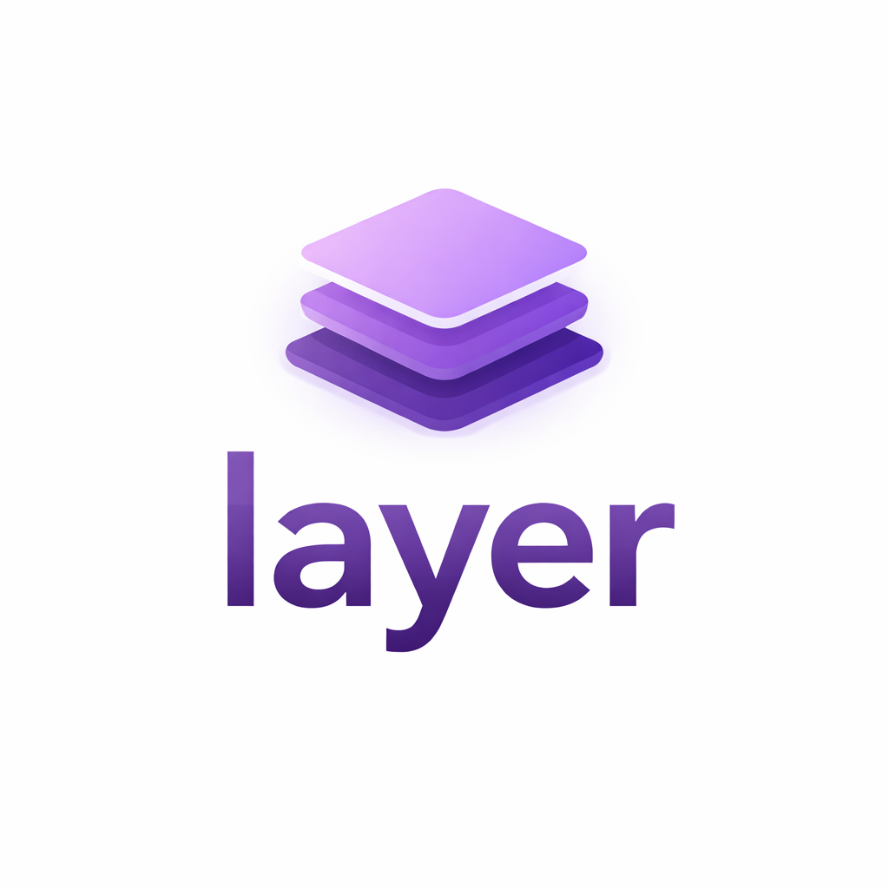
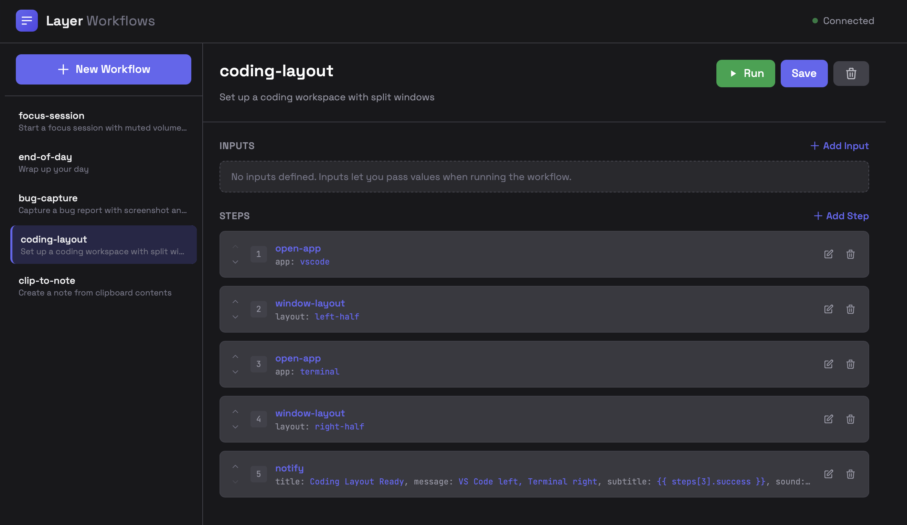
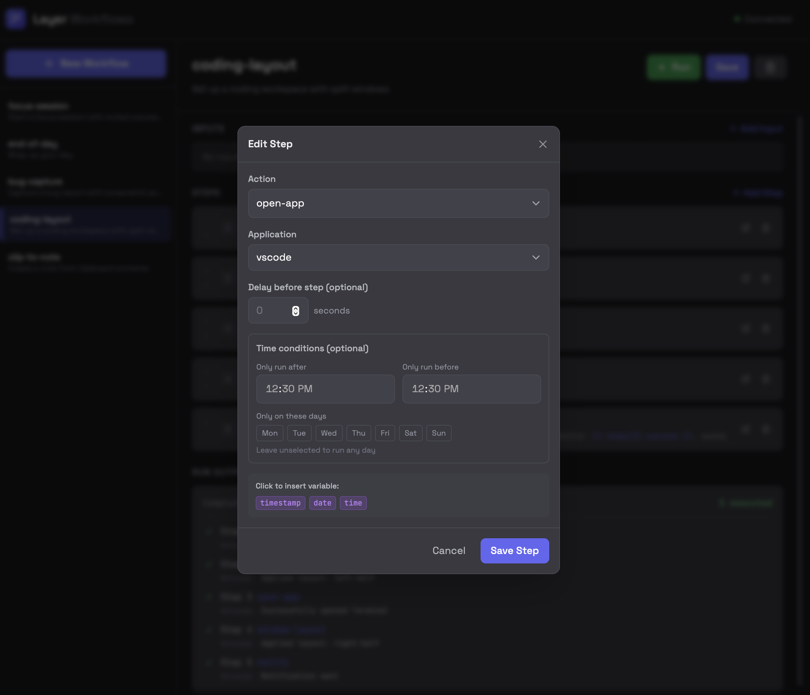
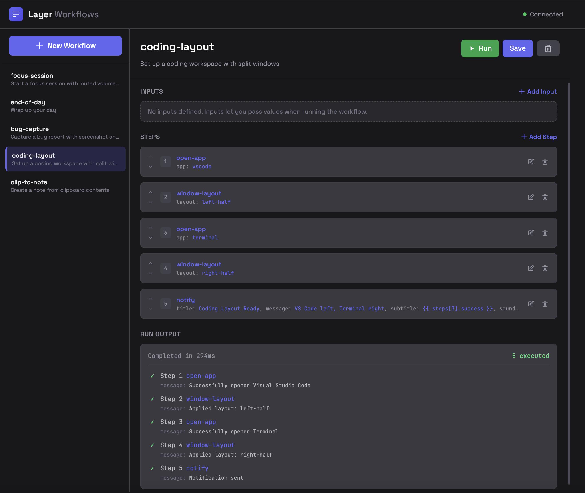

<p align="center">
  
</p>

<p align="center">
  <strong>A secure, minimal API layer for remote macOS automation.</strong>
</p>

<p align="center">
  Turn your Mac into a programmable endpoint that can receive commands from AI agents, automation systems, or remote clients.
</p>

---

## Features

- **Custom Workflows** - Define multi-step automations in YAML, chain any actions together
- **Visual Workflow Editor** - Web UI for creating and managing workflows
- **Application Control** - Open whitelisted macOS apps
- **Notes** - Create Apple Notes
- **Clipboard** - Read/write system clipboard
- **Screenshots** - Capture and save screenshots
- **Notifications** - Send macOS notifications
- **Text-to-Speech** - Speak text aloud
- **System Controls** - Volume, sleep, lock
- **Shortcuts** - Run Shortcuts.app workflows
- **Filesystem** - Read/write files in safe directories
- **Pomodoro Timer** - Built-in focus timer with notifications
- **Window Layout** - Arrange windows (requires Rectangle app)
- **API Key Authentication** - Secure all endpoints

## Prerequisites

- macOS (Ventura or later)
- Python 3.11+

### Optional: Rectangle (for Window Layout)

The `window-layout` action requires [Rectangle](https://rectangleapp.com/) to be installed.

```bash
# Install via Homebrew
brew install --cask rectangle
```

After installing, grant Rectangle accessibility permissions:
1. Open **System Preferences > Privacy & Security > Accessibility**
2. Enable Rectangle in the list

## Quick Start

```bash
# Create virtual environment
python3 -m venv venv
source venv/bin/activate

# Install dependencies
pip install -r requirements.txt

# Setup environment (generate your own API key)
cp .env.example .env
python -c "import secrets; print(secrets.token_urlsafe(32))"
# Edit .env and paste the generated key

# Start the server
python src/main.py
```

The API runs at `http://localhost:8000`

**Open the Workflow Editor:** Navigate to `http://localhost:8000` in your browser.

> **Note:** On first run, `workflows.example.yaml` is copied to `workflows.yaml`. Your workflows won't be tracked by git - they're yours to customize!

---

## Custom Workflows

The core feature of Layer is **custom workflows**. Define multi-step automations in `workflows.yaml` or via the web UI.

### Example: workflows.yaml

```yaml
workflows:
  morning-setup:
    description: "Open apps and arrange windows for work"
    steps:
      - action: open-app
        params:
          app: slack
      - action: open-app
        params:
          app: cursor
      - action: window-layout
        params:
          layout: left-half
      - action: notify
        params:
          title: "Ready to work"
          message: "Your workspace is set up"

  bug-capture:
    description: "Screenshot + clipboard to Notes"
    inputs:
      - name: title
        default: "Bug Report"
    steps:
      - action: save-screenshot
      - action: clipboard-get
      - action: create-note
        params:
          title: "{{ input.title }} - {{ timestamp }}"
          content: |
            ## Screenshot
            Saved to: {{ steps[0].path }}
            
            ## Clipboard
            {{ steps[1].text }}
      - action: notify
        params:
          title: "Bug Captured"
          message: "Screenshot saved to Downloads"

  focus-session:
    description: "Start a focus session"
    inputs:
      - name: duration
        default: 25
    steps:
      - action: volume
        params:
          mute: true
      - action: pomodoro-start
        params:
          work_duration: "{{ input.duration }}"
      - action: notify
        params:
          title: "Focus Mode"
          message: "{{ input.duration }} minutes - let's go!"
```

### Running Workflows

```bash
# Run with defaults
curl -X POST http://localhost:8000/run/morning-setup \
  -H "X-API-Key: YOUR_KEY"

# Run with custom inputs
curl -X POST http://localhost:8000/run/focus-session \
  -H "X-API-Key: YOUR_KEY" \
  -H "Content-Type: application/json" \
  -d '{"duration": 45}'
```

### Variable Substitution

Use `{{ }}` syntax in params:

| Variable | Description |
|----------|-------------|
| `{{ input.name }}` | Runtime input value |
| `{{ steps[0].field }}` | Output from previous step |
| `{{ timestamp }}` | Current datetime |
| `{{ date }}` | Current date |
| `{{ time }}` | Current time |

### Step Timing

Add delays or time-based conditions to steps:

```yaml
steps:
  - action: open-app
    params:
      app: slack
  - action: notify
    delay: 2  # Wait 2 seconds before this step
    params:
      title: "Ready"
      message: "Slack should be open now"
  
  # Only send this notification in the afternoon on weekdays
  - action: notify
    time_after: "14:00"
    time_before: "18:00"
    days: [mon, tue, wed, thu, fri]
    params:
      title: "Afternoon reminder"
      message: "Time for a break!"
```

| Option | Description | Example |
|--------|-------------|---------|
| `delay` | Seconds to wait before step | `delay: 2` |
| `time_after` | Only run after this time | `time_after: "09:00"` |
| `time_before` | Only run before this time | `time_before: "17:00"` |
| `days` | Only run on these days | `days: [mon, wed, fri]` |

### Available Actions

| Action | Description | Key Params |
|--------|-------------|------------|
| `open-app` | Open an application | `app` |
| `notify` | Send notification | `title`, `message` |
| `speak` | Text-to-speech | `text` |
| `screenshot` | Capture as base64 | - |
| `save-screenshot` | Save to Downloads | `filename` (optional) |
| `clipboard-get` | Get clipboard text | - |
| `clipboard-set` | Set clipboard text | `text` |
| `create-note` | Create Apple Note | `title`, `content` |
| `open-url` | Open URL in browser | `url` |
| `volume` | Set volume | `level`, `mute` |
| `sleep` | Put Mac to sleep | - |
| `lock` | Lock screen | - |
| `window-layout` | Arrange windows | `layout`, `app` |
| `run-shortcut` | Run Shortcuts.app | `name`, `input` |
| `pomodoro-start` | Start timer | `work_duration`, `break_duration` |
| `pomodoro-stop` | Stop timer | - |
| `pomodoro-status` | Get timer status | - |

### Window Layouts (Rectangle)

Available layouts for `window-layout`:

- `left-half`, `right-half`, `top-half`, `bottom-half`
- `top-left`, `top-right`, `bottom-left`, `bottom-right`
- `first-third`, `center-third`, `last-third`
- `first-two-thirds`, `last-two-thirds`
- `maximize`, `almost-maximize`, `center`, `restore`

---

## Web UI

Open `http://localhost:8000` for the visual workflow editor.

### Workflow List & Editor

Browse your workflows in the sidebar. Select one to view its steps, inputs, and description. Use the **Run**, **Save**, and **Delete** buttons in the top-right.



Each step shows its action type and parameters. Use the arrow buttons to reorder steps, or click the edit/delete icons.

### Adding & Editing Steps

Click **+ Add Step** to create a new step. The modal lets you:

- Select an action from the dropdown
- Configure action-specific parameters
- Add optional delays (seconds to wait before executing)
- Set time conditions (only run after/before certain times, or on specific days)
- Click variable chips to insert dynamic values into parameters



### Run Output

After running a workflow, see detailed results for each step. Screenshots are displayed inline and can be downloaded or copied as base64.



---

## API Endpoints

All endpoints (except `/ping` and `/`) require the `X-API-Key` header.

### Workflows

| Method | Endpoint | Description |
|--------|----------|-------------|
| `GET` | `/workflows` | List all workflows |
| `GET` | `/workflows/{name}` | Get workflow definition |
| `PUT` | `/workflows/{name}` | Create/update workflow |
| `DELETE` | `/workflows/{name}` | Delete workflow |
| `POST` | `/run/{name}` | Execute workflow |

### Core Actions

| Method | Endpoint | Description |
|--------|----------|-------------|
| `GET` | `/ping` | Health check |
| `GET` | `/allowed-apps` | List whitelisted apps |
| `POST` | `/open-app` | Open application |
| `POST` | `/create-note` | Create Apple Note |
| `GET` | `/clipboard` | Get clipboard |
| `POST` | `/clipboard` | Set clipboard |
| `GET` | `/screenshot` | Capture screenshot (base64) |
| `POST` | `/open-url` | Open URL |
| `POST` | `/run-shortcut` | Run Shortcut |
| `POST` | `/notify` | Send notification |
| `POST` | `/speak` | Text-to-speech |
| `GET` | `/volume` | Get volume |
| `POST` | `/volume` | Set volume |
| `POST` | `/sleep` | Sleep Mac |
| `POST` | `/lock` | Lock screen |

### Pomodoro

| Method | Endpoint | Description |
|--------|----------|-------------|
| `POST` | `/pomodoro/start` | Start timer |
| `GET` | `/pomodoro/status` | Get status |
| `POST` | `/pomodoro/stop` | Stop timer |
| `POST` | `/pomodoro/skip` | Skip to next phase |

### Filesystem

| Method | Endpoint | Description |
|--------|----------|-------------|
| `POST` | `/files/list` | List directory |
| `POST` | `/files/read` | Read file |
| `POST` | `/files/write` | Write file |
| `GET` | `/downloads` | List Downloads |

---

## Whitelisted Applications

Default apps that can be opened:

`spotify`, `safari`, `chrome`, `firefox`, `vscode`, `cursor`, `terminal`, `iterm`, `notes`, `calendar`, `mail`, `messages`, `slack`, `discord`, `finder`, `preview`, `textedit`

Add more in `config.py`:

```python
ALLOWED_APPS = {
    "myapp": "My Application Name",
    ...
}
```

---

## Security

⚠️ **Important:**

1. Never expose port 8000 directly to the internet
2. Keep your API key secret
3. Use HTTPS via tunnel for remote access

### Remote Access

```bash
# Using ngrok
ngrok http 8000
```

---

## Permissions

macOS will prompt for permissions on first use:

1. **System Preferences > Privacy & Security > Automation**
   - Enable Terminal/your app for Notes, System Events
   
2. **System Preferences > Privacy & Security > Accessibility**
   - Required for lock screen, window layout

---

## Project Structure

```
layer/
├── src/                    # Python source code
│   ├── main.py             # FastAPI server entry point
│   ├── executor.py         # macOS automation functions
│   ├── workflow_engine.py  # Workflow loading/execution
│   ├── wallpaper_generator.py  # Dynamic wallpaper
│   ├── config.py           # Configuration & allowed apps
│   ├── schemas.py          # Pydantic models
│   └── pomodoro.py         # Pomodoro timer logic
├── static/                 # Web UI
│   ├── index.html
│   └── app.js
├── openapi/                # Generated API specs
├── assets/                 # README images
├── workflows.example.yaml  # Example workflows (committed)
├── workflows.yaml          # Your workflows (gitignored)
├── .env.example            # Template for environment vars
├── .env                    # Your API keys (gitignored)
└── requirements.txt        # Python dependencies
```

**What's committed vs. ignored:**
| File | Committed | Description |
|------|-----------|-------------|
| `workflows.example.yaml` | ✅ | Example workflows for new users |
| `workflows.yaml` | ❌ | Your personal workflows |
| `.env.example` | ✅ | Template showing required vars |
| `.env` | ❌ | Your API key |

---

## Troubleshooting

**"MAC_API_KEY not set"**
- Copy `.env.example` to `.env` and add your API key

**Window layout not working**
- Install Rectangle: `brew install --cask rectangle`
- Grant accessibility permissions
- Ensure Rectangle is running

**Lock screen fails**
- Grant accessibility permissions to Terminal

**Notes permission denied**
- Enable automation permissions for Notes
